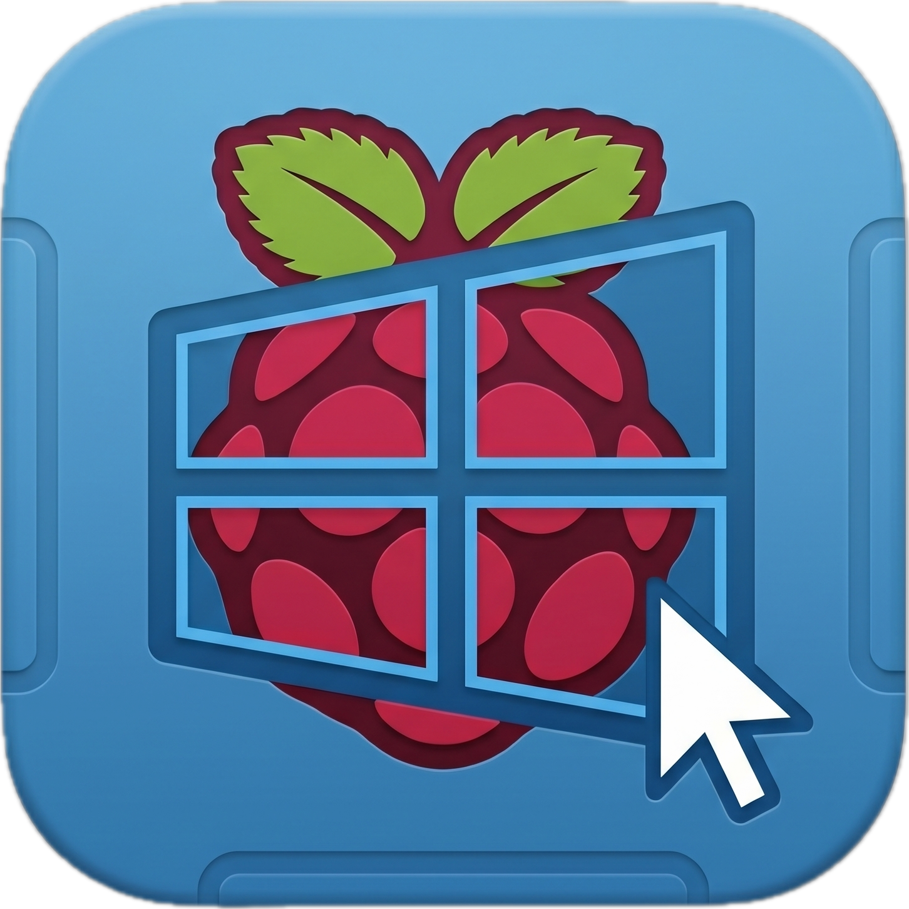

<p align="center">
  
</p>

# NS PC Control

**Control your switch or switch 2 console from a PC (Windows, Linux, macOS) or through your browser/phone with low latency using a Raspberry Pi.**

This project was built from scratch in **C++** and uses **UDP** for low latency. It is designed for playing console games with your PC controller while avoiding the typical lag of Bluetooth or heavy script-based solutions.

**Up to 4 players simultaneously** - Works with a single Raspberry Pi and a single PC.

**Keyboard Support** - Desktop clients support keyboard controls, either by overriding P1 or by using the keyboard as one player.

**Web App & Mobile Touch Controls** - The server includes an embedded web interface with a desktop control panel and touch-optimized mobile gamepad, no client install needed.

**Gyroscope and Rumble** - PC clients with gyro-capable controllers (DS4, DualSense, compatible USB motion pads), Android and iOS can send motion data! Rumble is only supported on PC clients or controllers connected through the mobile apps.

**Macros** - Create, record and share your own macros from any PC client!

**Play it whenever you wish to!** With the new support of wake up packets for the switch 2, the switch can now remain asleep until you connect to the server (additional setup required, still not released, test it in actions)!

**Supports any raspberry pi with usb gadget!**

> **Pre-compiled Binaries Available!**
> You can download ready-to-use GUI/CLI clients and the Raspberry Pi server directly from the **[Releases](https://github.com/Dycool/NS-PC-Control/releases)** page.
>
> The web interface is included in the Raspberry Pi server binary - no additional files needed.

https://github.com/user-attachments/assets/aef8eb25-dd14-4335-a3f7-b1953800f856

---

## Quick Start (Pre-compiled)

**1. Raspberry Pi (Server):**
* Download `ns-pc-control-raspberry-pi.zip` to your Pi.
* Enable usb gadget, check the [raspbery pi setup](docs/raspberry-pi-setup.md) for more details.
* Start the backend: `sudo chrt -f 99 ./ns-backend`

**2. PC / Mobile (Client):**
* **Desktop** — Download the zip for your OS (Windows, Mac, or Linux), launch `ns-client`, enter your Pi's IP.
* **Android** — Download `NS-mobile.apk` from the release and install it.
* **iOS** — Download `NS-mobile.ipa` from the release (sideload via iloader).
* **Up to 4 controllers** are supported simultaneously on a single client.
> Mobile clients do not support rumble with touch controls.

**3. Web App (Optional):**
* The backend includes an embedded web server with mobile touch controls.
* Enable it with the `-w` flag: `sudo chrt -f 99 ./ns-backend -w`
* Open `http://<pi-ip>:8080` in your browser.
* See the **[Web App Guide](docs/web-app.md)** for details.

---

## Controller Emulation Modes

The Raspberry Pi server can emulate **two different controller profiles**:

| Feature | Hori Controllers | Pro Controllers |
|---------|--------------------|---------------------|
| HID report size | 8 bytes | 64 bytes |
| **Latency** | **Fastest** | **Fast** |
| **Gyro** | **No** | **Yes** |
| **Rumble** | **No** | **Yes** |

Default mode is the pro controller. Use `-hori` if you have any issues with the other mode:

```bash
sudo chrt -f 99 ./ns-backend -hori
```

---

## Controls & Shortcuts

Any **SDL-compatible controller** connected to your client is supported, so basically any controller on the market.

| Action  | Shortcut |
| ------- | -------- |
| HOME    | Press **GUIDE** button, or **L3 + R3** simultaneously |
| CAPTURE | Press **START + BACK** simultaneously |

>These shortcuts can be disabled on the PC client.

---

## Documentation

Detailed guides and technical information are in the `docs/` folder:

* **[Raspberry Pi System Setup](docs/raspberry-pi-setup.md)** - Enabling USB gadget mode and automating on boot.
* **[Building from Source](docs/building-from-source.md)** - Compiling the desktop client (Windows/Mac/Linux), Android/iOS mobile apps, and server from scratch.
* **[Controller Modes](docs/controller-modes.md)** - Legacy vs modern backend mode, gyro, rumble, and how to choose.
* **[Macros](docs/macros.md)** - Recording and replaying button sequences for speedruns and TAS.
* **[Architecture & Security](docs/architecture.md)** - Latency optimization tips and HMAC-SHA256 protocol details.
* **[Web App & Mobile Clients](docs/web-app.md)** - Using the embedded web interface and mobile touch controls.
* **[Wakeup Setup](docs/wakeup.md)** - How to configure the wakeup packet for the switch 2.
* **[My vision](docs/vision.md)** - The main goal behind this project.

---

## References

| Components | Sources |
|---|---|
| **Desktop clients** | [Qt6 Widgets](https://doc.qt.io/qt-6/qtwidgets-index.html) / [SDL3 Gamepad API](https://wiki.libsdl.org/SDL3) / UDP sockets |
| **Android client** | Kotlin + WebView / JNI C bridge / UDP sockets |
| **iOS client** | Swift + WKWebView / C bridge / [GameController](https://developer.apple.com/documentation/gamecontroller) / [CoreMotion](https://developer.apple.com/documentation/coremotion) |
| **Raspberry Pi server** | [Linux USB Gadget (configfs / libcomposite)](https://www.kernel.org/doc/html/latest/usb/gadget_configfs.html) / UDP sockets |
| **Cryptography** | [HMAC-SHA256](https://datatracker.ietf.org/doc/html/rfc4868) (standalone C++ implementation) |
| **Protocol** | Custom UDP-based protocol with magic/version/sequence number guards |
| **Pro controller Emulation** | [switch-auto-core](https://github.com/churunfa/switch-auto-core) by [churunfa](https://github.com/churunfa)
|**Switch 2 Wake Setup**|[Switch2-RPI-Wake](https://github.com/Bill-git1/Switch2-RPI-Wake) by [Bill-git1](https://github.com/Bill-git1)|


---

## Reporting Issues

Found a bug or have a feature request? Open an issue at **[github.com/Dycool/NS-PC-Control/issues](https://github.com/Dycool/NS-PC-Control/issues)** with as much detail as possible (OS, controller model, reproduction steps).

---

## License

See the repository license for details.
